# Briefly - AI Webpage Assistant

Briefly is a Chromium browser extension that helps you read and understand webpages with ease. Powered by AI, it provides on-page summarization and context-aware Q&A directly within the browser. With multilingual support, personalization options, offline access, and smart features like PDF and image understanding, Briefly brings you a convenient and efficient reading assistant right where you need it.

---

## ✨ Features

- **On-page Assistant**: Chat with Briefly directly on any webpage — ask context-aware questions and get concise summaries without switching tabs.
- **Quick Actions**: Instantly summarize content, extract key points, or have complex text explained in simple terms.
- **Notes**: Add, edit, and manage personal notes for each webpage to keep track of your insights.
- **PDF Understanding**: Read and summarize PDFs right inside your browser, just like any other webpage.
- **Image Understanding**: Automatically analyze on-page images to enhance comprehension.
- **Multilingual Support**: Get responses in either English or Vietnamese, seamlessly switching between languages.
- **Personalization**: Customize the response style, level of detail, and preferred language to match your needs.
- **Feedback**: Rate AI responses with stars and comments to continuously improve your experience.
- **Chat History**: Browse, revisit, and continue past conversations right from the sidebar.
- **Offline Access**: Stay productive with access to your saved chats even when you’re offline.

---

## 🛠️ Installation Guide

### 1. Clone the Repository

```bash
git clone https://git.itim.vn/coccoc/capstone-2025.git
cd capstone-2025
```

### 2. Configure Environment

Create a `.env` file inside the `/server` directory with the following structure:

```env
# General
NODE_ENV=development
EXTENSION_ID=fnbbiklifmlapflfjcmbjlpklgfafllh
GOOGLE_CLIENT_ID=833310676000-755pdr3r9isck33epnmom0e8v2vfcsvs.apps.googleusercontent.com
FACEBOOK_APP_ID=684792190680106
FACEBOOK_APP_SECRET=<your-facebook-app-secret>
SESSION_TTL=604800
SUMMARY_TTL=86400
OPENAI_API_KEY=<your-openai-api-key>

# Redis config
REDIS_HOST=<your-redis-host>
REDIS_PORT=<your-redis-port>
REDIS_USERNAME=<your-redis-username>
REDIS_PASSWORD=<your-redis-password>
REDIS_PREFIX=capstone

# MySQL config
MYSQL_HOST=<your-mysql-host>
MYSQL_PORT=<your-mysql-port>
MYSQL_USERNAME=<your-mysql-username>
MYSQL_PASSWORD=<your-mysql-password>
MYSQL_DATABASE=<your-database-name>

# Qdrant config
QDRANT_URL=<your-qdrant-url>
QDRANT_API_KEY=<your-qdrant-api-key>
QDRANT_ENABLE_BINARY_QUANTIZATION=true
QDRANT_ENABLE_RESCORING=true
```

Create another `.env` file inside the root directory (same level with `docker-compose.yml`) with the following structure:

```
# App service
APP_NAME=capstone-2025
APP_PORT=3000

# Nginx service
NGINX_HOST_HTTP_PORT=8080
```

### 3. Start the Backend Server

**3.1 Run with NodeJS**

```bash
cd server
npm install
npm run dev
```

**3.2 Run with Docker**

Run the server

```bash
docker compose up --build
```

Run the monitoring stack

```bash
docker compose -f docker-compose.monitoring.yml up --build
```

Run the server and monitoring at once

```bash
docker compose -f docker-compose.yml -f docker-compose.monitoring.yml up --build
```

### 4. Load the Extension

1. Open Chrome or Coc Coc or any Chromium browers, go to `chrome://extensions/`
2. Enable **Developer Mode**
3. Click **Load Unpacked**
4. Select the `extension` folder from the repository

---

## 🚀 User Guide

### 1. Launch the extension

Click the "Extensions" icon on the browser's toolbar
Click on the Briefly extension logo to open the AI assistant.

  

The assistant will be a sidebar that looks like this

  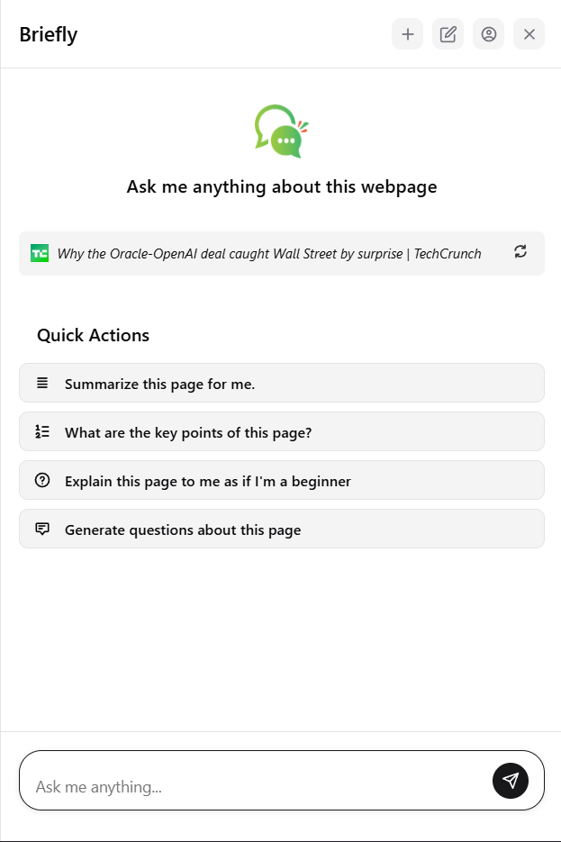

### 2. Using the toolbar

The toolbar is where you can access all features of Briefly.

  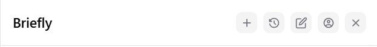

From left to right, they are:

- Start a new chat
- View chat history
- Take notes
- Account & Settings
- Close assistant

We suggest you start with signing first as some features are limited and only available to authenticated users

  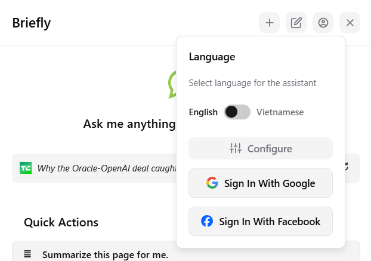

### 3. Chatting & quick actions

You can chat with the AI assistant using the chatbar

  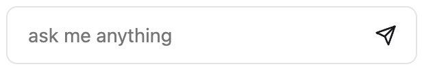

Or you can click on the Quick Actions button to summarize the page,
ask for key points, explaination or generate suggested question

  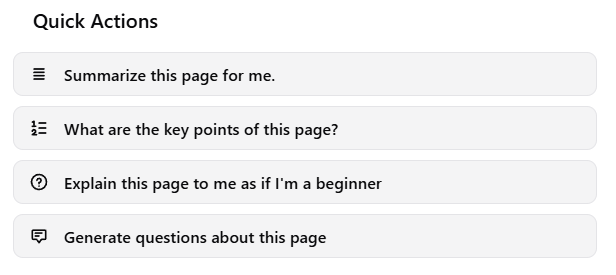
  
  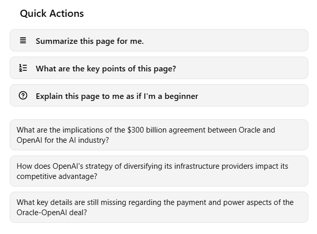

### 4. Feedback

Next to each response, there will be a small icon on the right, click it to send feedback for that specific response.

  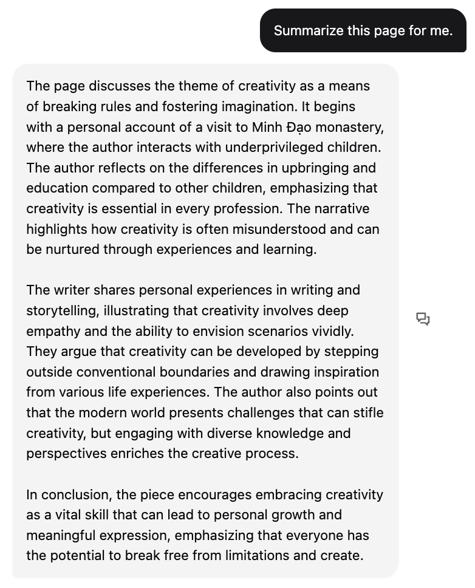

A feedback panel will appear, where you can rate and add comments.

  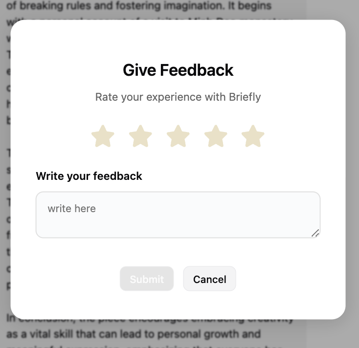

### 5. Access chat history

To access chat history, click on the chat history icon on the toolbar at the.  
You can delete, rename, or click to continue any conversations.

  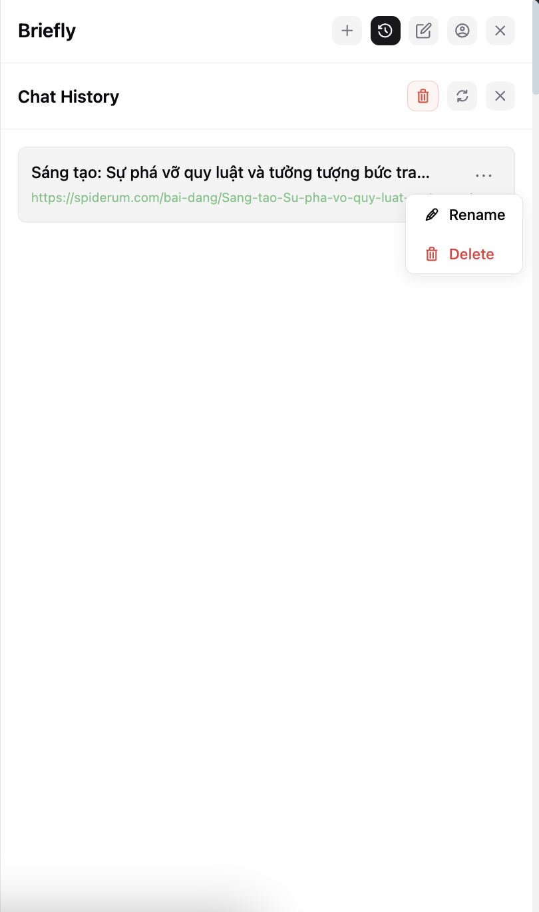

### 6. Add Personal Notes

Use the **Notes** tab to jot down personal insights per page. Notes are saved and associated with the page URL.  
To make management easier, we split the notes into two lists — notes associated with the currently active URL and all notes.

  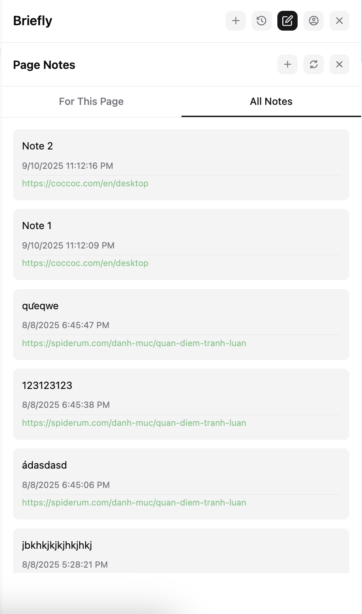

### 7. Adjust AI Behavior

Visit **Configure** panel to choose Summary style and Max response length.

  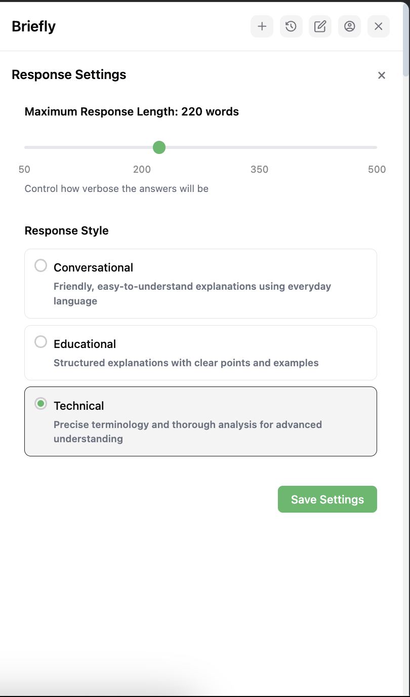

---

## 📄 License

[](LICENSE)
