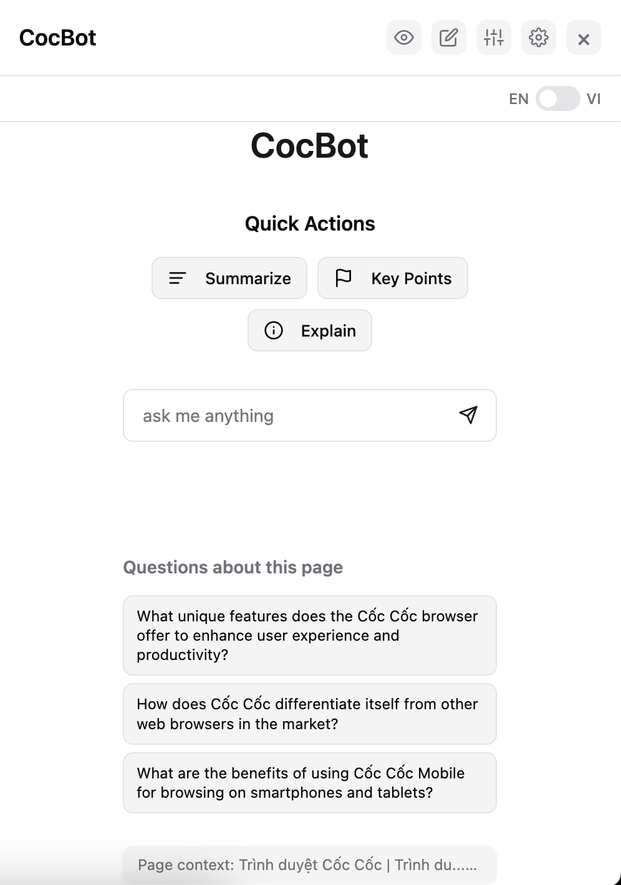
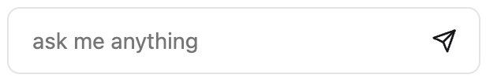
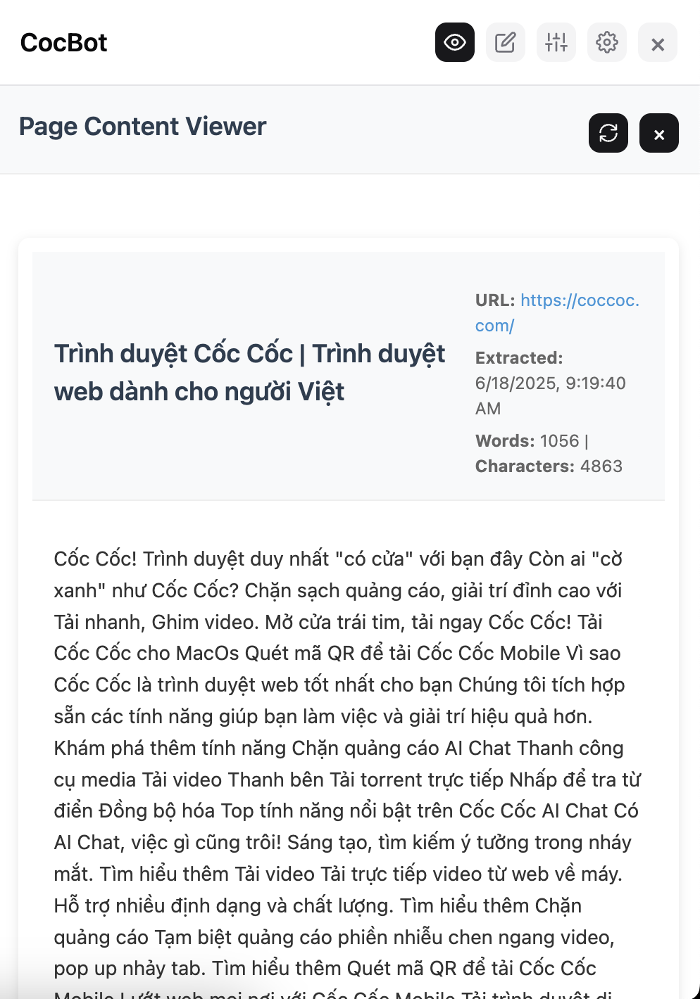
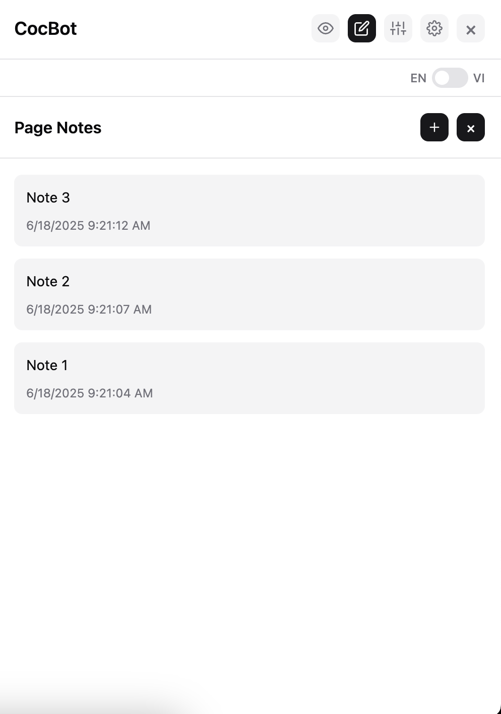
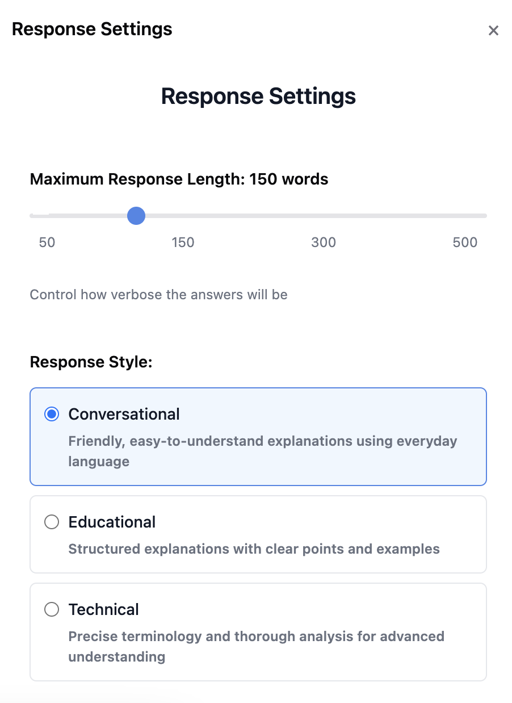

# CocBot - AI Webpage Assistant

CocBot is a Chrome-compatible browser extension designed to help users read and understand webpages using AI-powered summarization and contextual Q&A. Built for the Coc Coc browser and other Chromium-based platforms, CocBot integrates a sidebar assistant with multilingual support, image captioning, and note-taking capabilities.

---

## ✨ Features

- **Sidebar Assistant**: Chat with AI about the current page, ask context-aware questions, and receive summaries.
- **Quick Actions**: Summarize, extract key points, and explain content instantly.
- **Notes**: Add, edit, and manage notes per webpage with persistent storage.
- **Content Viewer**: View extracted content, tables, images, and structured data.
- **Image Captioning**: Automatically generates captions for images using backend AI.
- **Multilingual Support**: Works in English and Vietnamese.
- **Personalization**: Configure response style, length, and language.
- **Feedback System**: Rate responses with stars and optional comments. 
- **Chat History Persistence:**: Retain chat and notes across reloads (including anonymous sessions). 
- **Offline Access**: Recent chat history is available offline. 

---

## 🛠️ Installation

### 1. Clone the Repository

```bash
git clone https://github.com/andrewcoldbrew/Briefly
cd Briefly
```

### 2. Configure Environment

Create a `.env` file inside the `/server` directory with the following structure:

```env
# General
NODE_ENV=development
EXTENSION_ID=fnbbiklifmlapflfjcmbjlpklgfafllh
GOOGLE_CLIENT_ID=833310676000-755pdr3r9isck33epnmom0e8v2vfcsvs.apps.googleusercontent.com
FACEBOOK_APP_ID=684792190680106
FACEBOOK_APP_SECRET=<your-facebook-app-secret>
SESSION_TTL=604800
SUMMARY_TTL=86400
OPENAI_API_KEY=<your-openai-api-key>

# Redis config
REDIS_HOST=<your-redis-host>
REDIS_PORT=<your-redis-port>
REDIS_USERNAME=<your-redis-username>
REDIS_PASSWORD=<your-redis-password>
REDIS_PREFIX=capstone

# MySQL config
MYSQL_HOST=<your-mysql-host>
MYSQL_PORT=<your-mysql-port>
MYSQL_USERNAME=<your-mysql-username>
MYSQL_PASSWORD=<your-mysql-password>
MYSQL_DATABASE=<your-database-name>

# Qdrant config
QDRANT_URL=<your-qdrant-url>
QDRANT_API_KEY=<your-qdrant-api-key>
QDRANT_ENABLE_BINARY_QUANTIZATION=true
QDRANT_ENABLE_RESCORING=true
```

Create another `.env` file inside the root directory (same level with `docker-compose.yml`) with the following structure:
```

```

### 3. Start the Backend Server
**3.1 Run with NodeJS**

```bash
cd server
npm install
npm run dev
```

**3.2 Run with Docker**
Run the server 
```bash
docker compose up
```
Run the monitoring stack 
```bash
docker compose -f docker-compose.monitoring.yml up
```
Run the server and monitoring at once
```bash
docker compose -f docker-compose.yml -f docker-compose.monitoring.yml up
```

### 4. Load the Extension

1. Open Chrome or Coc Coc or any Chromium browers, go to `chrome://extensions/`
2. Enable **Developer Mode**
3. Click **Load Unpacked**
4. Select the `extension` folder from the repository

---

## 🚀 Usage

### 1. Launch the Sidebar

- Click the CocBot icon in the browser toolbar. The sidebar appears on the right.

  

### 2. Summarize and Ask Questions

- Type queries into the chat bar.

  

- Use Quick Action buttons to generate summaries, explanations or extract highlights.

  

### 3. View Extracted Content

- Click **View Page Content** to explore a structured version of the page (text, images, tables, etc.).

  

### 4. Add Personal Notes

- Use the **Notes** tab to jot down personal insights per page. Notes are saved and associated with the page URL.

  

### 5. Adjust AI Behavior

- Visit **Configure** panel to choose Summary style and Max response length.

  

---

## 📄 License

[](LICENSE)
